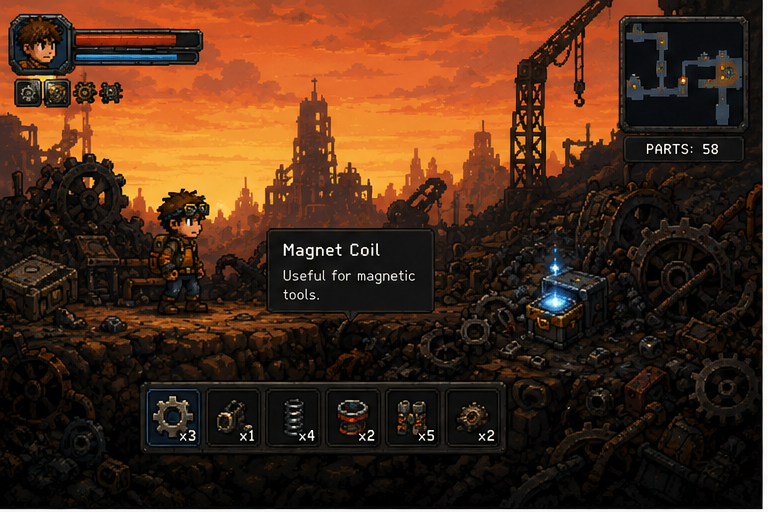
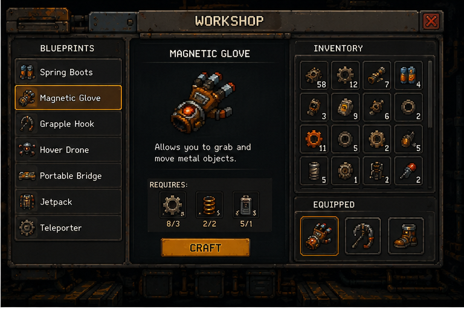
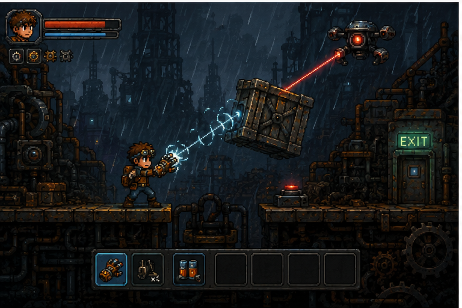
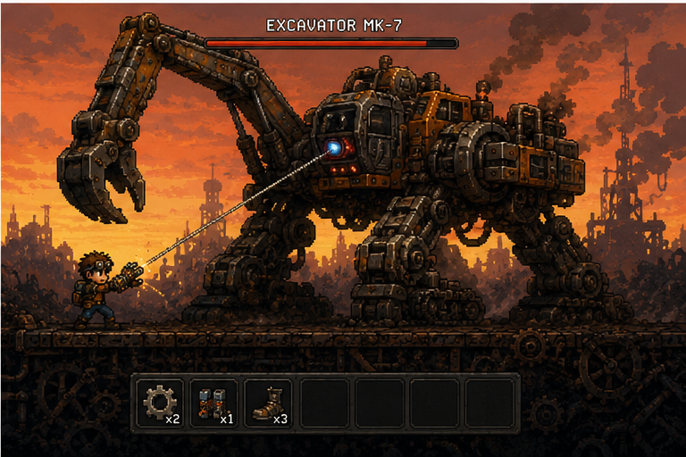

# Junkyard Inventor 🔩🔋✨

### 🛠️ Developed by **AHMED MH HEGAZY**

A 2D physics puzzle platformer and crafting game set in a sprawling, rusty scrap heap. Instead of fighting enemies and collecting coins, you scavenge for broken machines, batteries, magnets, and gears to craft creative gadgets to bypass obstacles, solve environmental puzzles, and dismantle giant mechanical bosses.

| 🌅 1. Scrapyard Exploration | 🔧 2. Workshop & Blueprints |
| :---: | :---: |
|  |  |
| 🌧️ **3. Environmental Puzzle** | 🤖 **4. Excavator MK-7 Boss Fight** |
|  |  |

## Core Gameplay Loop
1. **Explore**: Traverse platforming levels filled with environmental hazards, rusty scrap piles, and rogue machinery.
2. **Scavenge**: Collect essential raw materials: **Gears**, **Springs**, **Batteries**, **Motors**, **Cables**, and **Magnet Coils**.
3. **Craft**: Open your Workshop Blueprint Book to construct utility gadgets and wearable tech.
4. **Solve**: Use your inventions (e.g., Magnetic Gloves to lift heavy iron blocks, Spring Boots to vault over gaps) to navigate the terrain.
5. **Dismantle**: Defeat massive machine bosses (like the **Excavator MK-7**) by outsmarting them and dismantling their components, rather than using raw force.

---

## 🛠️ Workshop & Crafting Recipes

All gadgets are constructed at the workshop screen using parts collected throughout the levels:

| Gadget | Description | Recipe | Equipped Slot |
| :--- | :--- | :--- | :--- |
| **Spring Boots** | Increases jump height by releasing coiled spring tension. | 3x Gears, 2x Springs | Feet |
| **Magnetic Glove** | Emits a high-frequency magnetic field to drag/repel metal. | 3x Gears, 2x Springs, 1x Battery | Hand |
| **Grapple Hook** | Motorized grappling hook for swinging across ceiling points. | 4x Cables, 1x Motor, 2x Gears | Tool |
| **Hover Drone** | Deployable scout that flies and interacts with distant buttons. | 2x Motors, 1x Battery, 2x Circuits | Tool |
| **Portable Bridge** | Foldable metal girders to cross wide chasms. | 6x Iron Plates, 2x Screws | Tool |
| **Jetpack** | Propels player upwards at the expense of electric battery charge. | 2x Thrusters, 3x Batteries, 1x Fuel Cell | Back |
| **Teleporter** | Instantly swaps player position with a target node. | 4x Circuits, 2x Batteries, 1x Core | Tool |

---

## 📂 Project Architecture

This repository contains the architecture, systems design, and mock-logic script layer for the game:

```
src/
├── Core/
│   └── GameLoop.cs             # Central game cycle (Tick, Render, Physics)
├── Player/
│   ├── PlayerController.cs     # 2D movement, states, and physics interactions
│   └── Inventory.cs            # Scrap inventory tracking and gear equipment
├── Crafting/
│   └── Workshop.cs             # Blueprint matching, recipe check, and crafting
├── Tools/
│   ├── MagneticGlove.cs        # Metal manipulation and magnetic field calculations
│   ├── GrappleHook.cs          # Anchor points, rope length constraint solver
│   └── SpringBoots.cs          # Kinetic force jump booster
├── Entities/
│   ├── Enemies/
│   │   └── SecurityDrone.cs    # Flying hazard, pathfinding, and target laser beam
│   └── Bosses/
│       └── ExcavatorBoss.cs    # Excavator MK-7 boss phase triggers & dismantling
└── Environment/
    └── PressurePlate.cs        # Switch mechanism activating external doors
```

---

## ⚡ How to Build & Simulate

This project uses a synthetic physics and state simulation layer. It simulates typical platformer runtime state inside a console interface to verify gameplay systems, item crafting formulas, and gadget interactions.

### Prerequisites
* [.NET SDK 8.0+](https://dotnet.microsoft.com/download)

### Run the Simulation
To build and run the text-based architecture mockup simulation:
```bash
dotnet run
```
You can pass flags to simulate different levels or crafting attempts:
```bash
dotnet run -- --craft magnetic-glove
dotnet run -- --boss excavator
```

---

*“One man's trash is an inventor's ticket out of the scrapyard.”* 🛠️🌅🌧️

---
Developed by **AHMED MH HEGAZY** 🛠️🚀

